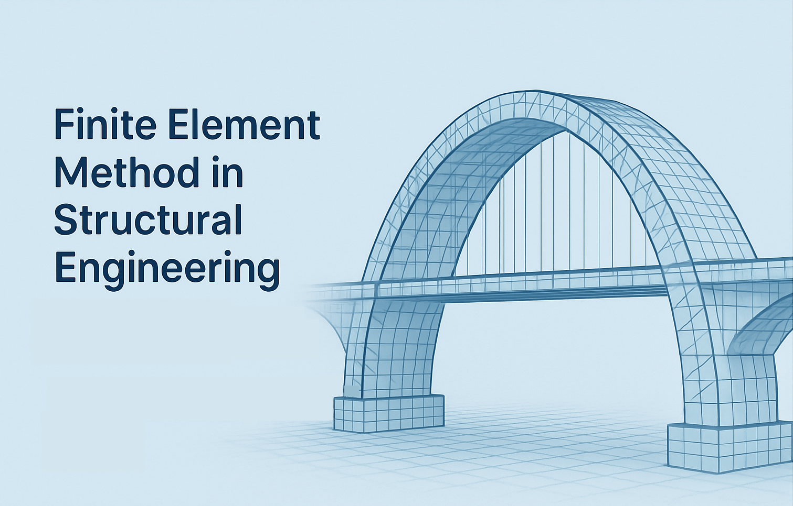

# Finite Element Method in Structural Engineering 

| **[Contents](Contents/Content.md)** | **[Syllabus](Contents/Syllabus.md)** | **[Contact](Contents/Contact.md)** |  

🚨 [All Notifications](Contents/Notifications.md)

 

---

*Discliamer: All rights and credits reserved to the respective owner(s) of the uploaded content/images. The uploaded content is solely for educational purpose. If you are the main copyright owner, contact to claim credit or content removal.*

---
