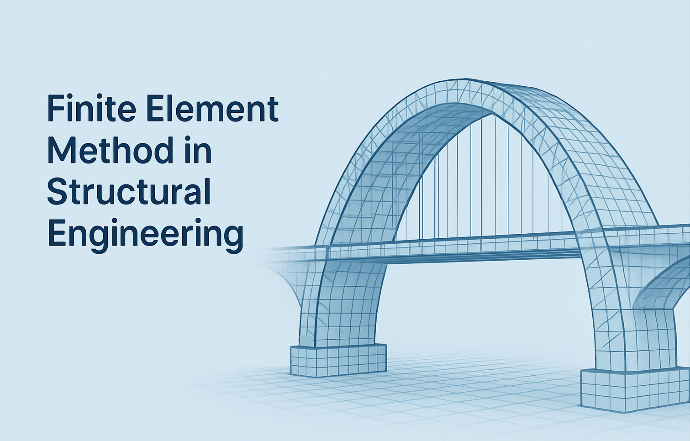

# Finite Element Method in Structural Engineering 

| **[Contents](Contents/Content.md)** | **[Syllabus](Contents/Syllabus.md)** | **[Contact](Contents/Contact.md)** |  

🚨 The due date for submitting Assignment 2 is October 12, 2025 (Sunday), by 11:59 PM. - [Click Here](https://gndec-yjs.github.io/FEM/Contents/Assignment_2025/2.html)

🚨 The due date for submitting Assignment 1 is September 21, 2025 (Sunday), by 11:59 PM. - [Click Here](https://gndec-yjs.github.io/FEM/Contents/Assignment_2025/1.html)

---

*Discliamer: All rights and credits reserved to the respective owner(s) of the uploaded content/images. The uploaded content is solely for educational purpose. If you are the main copyright owner, contact to claim credit or content removal.*

---
